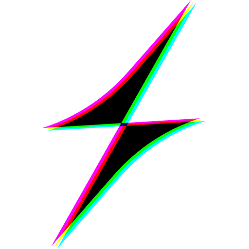

<p align="center">
  
</p>

<h1 align="center">
  ⚡ Same.Energy Android Client
</h1>

<p align="center">
  <em>Discover the visual internet — an elegant, AI-powered image search experience for Android.</em>
</p>

<p align="center">
  <a href="https://flutter.dev"></a>
  <a href="LICENSE"></a>
  <a href="https://developer.android.com"></a>
  <a href="https://github.com/MAITRI137/same-energy-android/pulls"></a>
  <a href="https://github.com/MAITRI137/same-energy-android"></a>
  <a href="https://github.com/MAITRI137/same-energy-android/commits/main"></a>
  <a href="https://github.com/MAITRI137/same-energy-android/actions/workflows/flutter_ci.yml"></a>
</p>

---

**Same.Energy Android Client** is a beautifully crafted, open-source Flutter application that brings the magic of [same.energy](https://same.energy) — an AI-powered visual search engine — to your pocket. Upload any image or type a description and instantly discover visually similar content from across the web. Featuring a stunning glassmorphism UI, buttery-smooth animations, and a thoughtfully designed architecture powered by Riverpod, this app delivers a premium search experience that feels native and delightful on every Android device.

---

## ✨ Features

### 🔍 Intelligent Search
- **Visual Search** — Upload or pick any image to find visually similar content
- **Text Search** — Natural-language queries with intelligent AI matching
- **Hybrid Search** — Combine an image seed with text for laser-precise results
- **Safe Search** — Configurable NSFW content filtering

### 🎨 Premium Design
- **Glassmorphism UI** — Translucent surfaces with gorgeous blur effects
- **Adaptive Themes** — Seamless light & dark mode with system integration
- **Fluid Animations** — Smooth fade, slide, and scale transitions everywhere
- **Masonry Grid** — Pinterest-style staggered layout with adjustable columns

### 📱 Core Experience
- **Curated Feeds** — Browse categories like Paintings, Nature, Architecture & more
- **Collections & Bookmarks** — Save and organise your favourites (sign-in required)
- **Image Details** — Full-screen viewer with download, share & "find similar"
- **Offline Support** — Local caching for reliable performance without connectivity
- **Deep Linking** — Open `same.energy` URLs directly in the app

### 🔧 Under the Hood
- **Riverpod State Management** — Predictable, testable reactive architecture
- **Dio Networking** — Robust HTTP client with interceptors & retry logic
- **GoRouter Navigation** — Declarative, type-safe routing with guards
- **Clickstream Telemetry** — Event tracking matching the web platform spec
- **Secure Storage** — Encrypted token management for authentication

---

## 🏗️ Architecture

The project follows **Clean Architecture** principles with clear separation of concerns:

```
lib/
├── core/                         # Shared infrastructure
│   ├── api/                      #   HTTP client, endpoints & data models
│   ├── auth/                     #   Authentication state & repository
│   ├── data/                     #   Repository implementations & remote data sources
│   ├── design/                   #   App theme, colours & typography
│   ├── domain/                   #   Repository interfaces (contracts)
│   ├── security/                 #   Biometric & collection lock services
│   ├── settings/                 #   User preferences provider
│   ├── storage/                  #   JSON cache, SharedPreferences & SecureStorage
│   └── telemetry/                #   Clickstream service & event models
├── features/                     # Feature-first modules
│   ├── about/                    #   About screen & Creative Commons notice
│   ├── auth/                     #   Login screen & bottom sheet
│   ├── collections/              #   Collection list, detail, lock & picker
│   ├── credits/                  #   Developer credits screen
│   ├── feed/                     #   Content feed browsing
│   ├── home/                     #   Main dashboard & discovery
│   ├── image_detail/             #   Full-screen image viewer
│   ├── profile/                  #   User profile & accent colour picker
│   ├── search/                   #   Search results & provider
│   └── settings/                 #   Settings screen
├── shared/widgets/               # Reusable UI components
│   ├── app_shell.dart            #   Scaffold with bottom navigation
│   ├── feed_chip_row.dart        #   Horizontal category chips
│   ├── glass_background.dart     #   Glassmorphism container
│   ├── image_grid.dart           #   Masonry grid widget
│   ├── image_tile.dart           #   Individual image card
│   ├── logo_bolt_icon.dart       #   Animated logo icon
│   └── search_bar.dart           #   Custom search input
├── router.dart                   # GoRouter configuration & guards
└── main.dart                     # App entry point & provider scope
```

**Tech Stack:**

| Layer | Technology |
|-------|-----------|
| Framework | Flutter 3.11+ |
| State Management | Riverpod |
| Networking | Dio |
| Navigation | GoRouter |
| Local Storage | SharedPreferences + SecureStorage |
| UI System | Material Design 3 + custom glassmorphism |

---

## 📸 Screenshots

<p align="center">
  <em>Screenshots coming soon — contributions welcome!</em>
</p>

<!-- Uncomment when screenshots are available:
| Light Mode | Dark Mode |
|:---:|:---:|
|  |  |
|  |  |
-->

---

## 🚀 Getting Started

### Prerequisites

| Requirement | Version |
|------------|---------|
| Flutter SDK | 3.11 or higher |
| Dart SDK | 3.11 or higher |
| Android Studio / VS Code | Latest stable |
| Android device or emulator | API 21+ (Lollipop) |

### Installation

```bash
# 1. Clone the repository
git clone https://github.com/MAITRI137/same-energy-android.git
cd same-energy-android

# 2. Install dependencies
flutter pub get

# 3. Run on a connected device / emulator
flutter run
```

### Running Tests

```bash
flutter test
```

### Building a Release APK

```bash
flutter build apk --release
# Output: build/app/outputs/flutter-apk/app-release.apk
```

---

## ⚙️ Configuration

This app connects to the public **same.energy** API and does not require any API keys or environment variables for basic functionality. Authentication is handled via the same.energy email login flow built into the app.

If you need to customise endpoints or behaviour, see:
- `lib/core/api/endpoints.dart` — API base URLs
- `lib/core/settings/app_settings_provider.dart` — User preferences

---

## 🗺️ Roadmap

- [ ] 🌐 Multi-language / i18n support
- [ ] 📷 Camera integration for instant visual search
- [ ] 🔔 Push notifications for trending content
- [ ] 🗂️ Collection sharing & collaboration
- [ ] 🎯 Search history & suggestions
- [ ] 📊 Usage analytics dashboard for users
- [ ] 🖼️ Wallpaper mode — set images as device wallpaper
- [ ] ♿ Accessibility audit & screen-reader improvements

---

## 🤝 Contributing

We love contributions! Whether it's fixing a typo or building a new feature, every PR is welcome.

Please read our **[Contributing Guide](CONTRIBUTING.md)** before getting started.

## 📋 Code of Conduct

This project is governed by the **[Contributor Covenant Code of Conduct](CODE_OF_CONDUCT.md)**. By participating, you agree to uphold a welcoming and inclusive environment.

## 🔒 Security

Found a vulnerability? Please review our **[Security Policy](SECURITY.md)** for responsible disclosure instructions.

## 📄 License

This project is licensed under the **MIT License** — see the [LICENSE](LICENSE) file for details.

## 📝 Changelog

All notable changes are documented in the [CHANGELOG](CHANGELOG.md).

---

## 🙏 Credits & Attribution

### Development Team

<table align="center">
  <tr>
    <td align="center">
      <a href="https://github.com/MAITRI137">
        <br />
        <sub><b>Maitri Kansagra</b></sub>
      </a><br />
      <em>UI/UX Design & Visual Polish</em><br/>
      <small>Screen layouts · Glassmorphism styling<br/>Animations · Theme system</small>
    </td>
    <td align="center">
      <a href="https://github.com/vyas-devgna">
        <br />
        <sub><b>Devgna Vyas</b></sub>
      </a><br />
      <em>Technical Architecture</em><br/>
      <small>App architecture · State management<br/>API integration · Auth & security</small>
    </td>
  </tr>
</table>

### Original Platform

<table align="center">
  <tr>
    <td align="center">
      <a href="https://github.com/AsyncBanana">
        <br />
        <sub><b>Jacob Jackson</b></sub>
      </a><br />
      <em>Creator of same.energy</em><br/>
      <small>AI Models · Core Search Technology<br/>Platform Infrastructure</small>
    </td>
  </tr>
</table>

**[same.energy](https://same.energy)** — The AI-powered visual search engine providing the core search technology, content curation, and platform infrastructure.

---

<p align="center">
  Made with ❤️ as an unofficial client for <a href="https://same.energy">same.energy</a>
</p>
